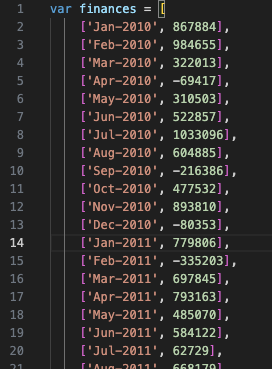
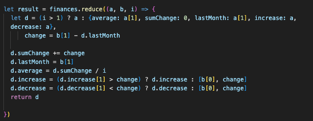

# Console-Finances
Contains the solution for Week 4 Challenge
This week's challenge focuses on taking a data set and using Javascript to create code for analysing the financial records of a company.

To begin with, I had a set of code for the array which looked like this:

Total number of months included:
I just returned the number of elements in the array object 'finances'.

The net total amount of Profit/Losses over the entire period:
I utilised the reduce() method, a callback function for all elements in the array and accumulated them into a single value.

The average of the 'changes' in Profit/Losses over the entire period:
I also utilised the 'reduce' function but this time calculating other things like average, sum of changes, last month's value and identifying the month with the maximum increase as well as month with maximum decrease from the finances array
